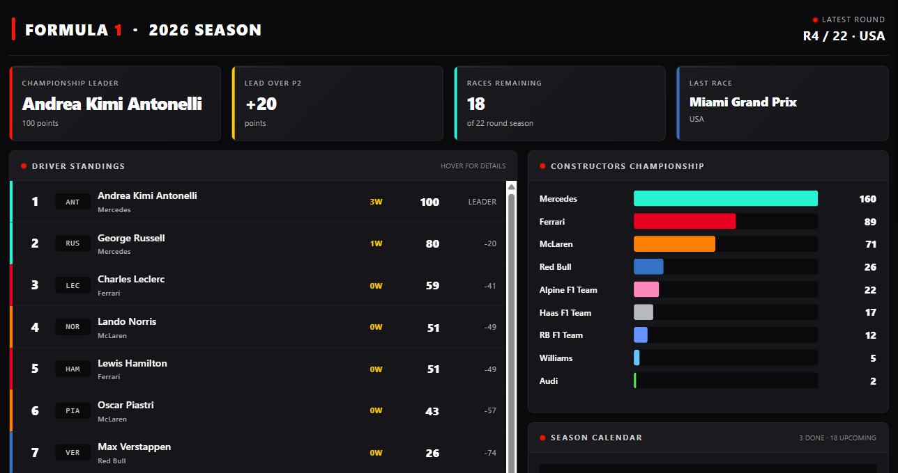
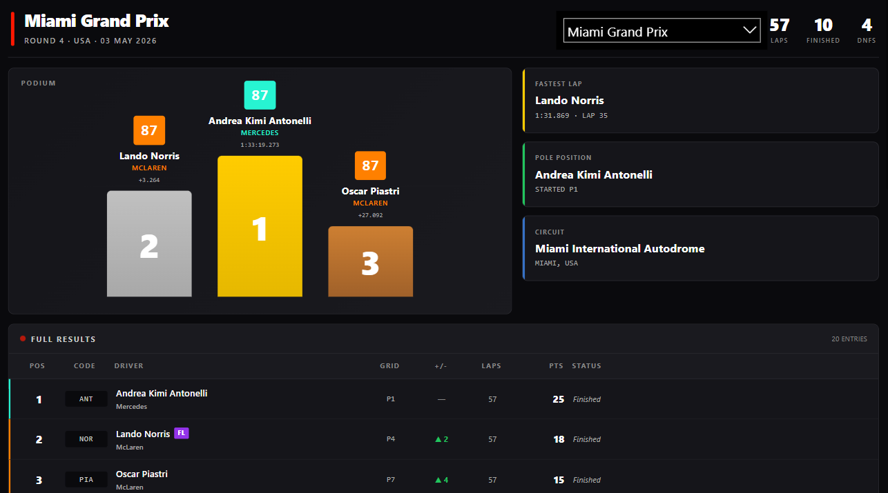
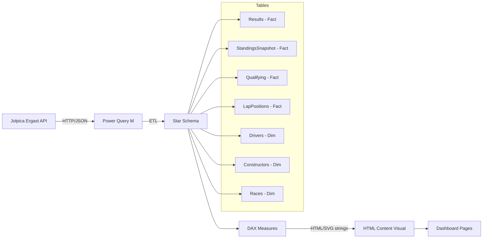

# F1 2026 Season Tracker

> A broadcast-quality Formula 1 dashboard built entirely inside Power BI — no embedded web apps, no external visuals doing the heavy lifting. Just DAX, M, and a lot of HTML/CSS/SVG generated by measures.

[](LICENSE)
[](https://learn.microsoft.com/en-us/power-bi/developer/projects/projects-overview)
[](https://github.com/jolpica/jolpica-f1)



## What this is

A personal F1 dashboard that tracks the entire 2026 season — driver and constructor standings, race-by-race deep dives, lap-by-lap position charts, and a calendar map of the global race weekends. It pulls live data from the Jolpica Ergast API and refreshes weekly after each Grand Prix.

The interesting bit isn't really the dashboard itself though — it's how it's built. Most of what you see (the leaderboard, the podium, the spaghetti chart, the calendar map) isn't a native Power BI visual. It's HTML and SVG generated by DAX measures and rendered through a single HTML Content custom visual per page. Power BI is doing the data modeling; the "front end" is essentially a hand-written component library expressed in DAX.

## Why I built it

I love F1, and I wanted something that looked like a broadcast graphics package rather than a corporate BI report. I also wanted to push Power BI further than it's typically used — to see whether you could build something genuinely beautiful inside it without cheating with embedded web frames or paid custom visuals.

A few things I learned along the way:

- The HTML Content visual is far more capable than its reputation suggests. CSS animations, gradients, hover states, custom tooltips — all work fine in the sandbox.
- DAX is genuinely capable of generating UI when you stop fighting it. The trick is composing small measures that return strings of HTML, then concatenating them.
- Star schema modeling matters even more when your "visuals" are HTML. Bad relationships mean wrong data injected into your strings, and HTML is unforgiving.
- F1 data is a delight to work with. The Jolpica/Ergast schema is clean, well-documented, and rich enough to support real analysis.

## Features

Four interactive pages, each built as a single HTML measure rendered in one HTML Content visual.

**Overview** — championship leader, points gap, races remaining, full driver standings with team colors and per-driver tooltip cards (wins, podiums, fastest laps, average finish, DNFs), constructors championship as horizontal bars, a stylized world map of the calendar with completed/upcoming/current race pins, and recent race winners.

**Race Results** — pick a race, see the full results: animated podium with gold/silver/bronze steps, fact cards for fastest lap and pole position, and a complete results table with team-colored borders, qualifying-vs-race position deltas (green up arrows / red down arrows), and DNF reasons.



**Race Analysis** — the lap-by-lap position chart, rendered as inline SVG. One line per driver in their team color, weaving across the chart. Hover any line to isolate it; all others dim. End-cap circles mark each driver's last lap (DNFs end mid-chart with dashed lines and "DNF L35" labels). Insight cards below show most laps led, biggest mover, and total position changes.

**Driver Deep Dive** *(in progress)* — driver-centric view with championship trajectory, points-per-race, qualifying vs race performance, and teammate head-to-head stats.

## Architecture



Single direction many-to-one relationships throughout. No bidirectional filters — they cause ambiguity, especially with the snapshot tables.

## Tech stack

- **Power BI Desktop** in PBIP format (so the model and report are JSON/TMDL files that diff cleanly in git, instead of binary `.pbix` blobs)
- **Power Query (M)** for all ETL — one query per table, with a parameterized loop for round-by-round standings and lap data
- **DAX** for measures — organized by purpose into separate `.dax` reference files
- **HTML Content custom visual** by Daniel Marsh-Patrick, from AppSource
- **Jolpica Ergast mirror** for the data — a community-maintained fork of the original Ergast F1 API

## Getting started

Full setup instructions are in [`docs/setup.md`](docs/setup.md). The short version:

1. Clone the repo
2. Install Power BI Desktop (latest version, with the PBIP preview feature enabled)
3. Install the **HTML Content** visual from AppSource
4. Open `pbip/F1SeasonTracker.pbip`
5. Set the data source credentials to **Anonymous** (Jolpica is a public API)
6. Refresh

If anything breaks during refresh, run `python scripts/check_api.py` to confirm the Jolpica endpoints are reachable.

## Project structure

<details>
<summary>Click to expand</summary>

```
.
├── pbip/                       Power BI project files (PBIP format)
│   ├── F1SeasonTracker.pbip
│   ├── F1SeasonTracker.Report/
│   └── F1SeasonTracker.SemanticModel/
├── power-query/                M code for each query, one file per query
│   ├── Races.pq
│   ├── Results.pq
│   ├── Qualifying.pq
│   ├── StandingsSnapshot.pq
│   ├── LapPositions.pq
│   ├── CurrentRound.pq
│   ├── Drivers.pq
│   └── Constructors.pq
├── dax/                        DAX measures organized by purpose
│   ├── foundational.dax
│   ├── championship.dax
│   ├── form-trends.dax
│   ├── qualifying-h2h.dax
│   └── html-visuals.dax
├── docs/                       Design docs
│   ├── setup.md                Step-by-step build instructions
│   ├── data-model.md           Schema and edge cases
│   ├── page-layouts.md         Wireframes for each page
│   └── refresh-strategy.md     Refresh cadence and failure modes
├── scripts/
│   └── check_api.py            Verify Jolpica endpoints
├── assets/
│   ├── screenshots/            Dashboard screenshots
│   ├── team-colors.json        Reference for team brand colors
│   └── f1-dark-theme.json      Power BI theme file
├── CLAUDE.md                   Context for Claude Code
├── CONTRIBUTING.md             How to contribute
├── CHANGELOG.md                Notable changes per release
└── README.md
```

</details>

## Roadmap

The Power BI dashboard is the foundation. The bigger plan is to grow this into a proper F1 data platform.

**Phase 1: Power BI dashboard** *(current)*
- [x] Overview page with standings, calendar map, recent races
- [x] Race Results page with podium and full results table
- [x] Race Analysis page with lap-by-lap position chart
- [ ] Driver Deep Dive page
- [ ] Constructor Battle page
- [ ] Circuit detail map on the Race page

**Phase 2: Public web version**
- [ ] Port the visualizations to a Next.js + Tailwind web app
- [ ] Backend: scheduled job (Postgres or Supabase) that hits Jolpica nightly
- [ ] Public deployment so anyone can use the dashboard without Power BI

**Phase 3: Telemetry and analysis**
- [ ] Python notebooks using FastF1 for car telemetry analysis
- [ ] Tire degradation analysis, qualifying lap deltas, sector comparisons
- [ ] Embed key insights back into the dashboard

**Phase 4: Predictive modeling**
- [ ] Simple model predicting qualifying position from FP sessions
- [ ] Finishing position model based on grid + historical track performance
- [ ] Writeup of what features matter and where the model fails

## Contributing

PRs welcome. See [`CONTRIBUTING.md`](CONTRIBUTING.md) for conventions and setup.

If you're using Claude Code in VS Code, the [`CLAUDE.md`](CLAUDE.md) file at the root has project context the agent will pick up automatically.

## Acknowledgments

- **[Jolpica F1](https://github.com/jolpica/jolpica-f1)** for maintaining the F1 API after the original Ergast service began winding down
- **[Ergast](http://ergast.com/mrd/)** for decades of free F1 data
- **[FastF1](https://github.com/theOehrly/Fast-F1)** for the telemetry library that will power phase 3
- **Daniel Marsh-Patrick** for the [HTML Content custom visual](https://appsource.microsoft.com/en-us/product/power-bi-visuals/wa200001930) that makes all this possible

## License

MIT — see [`LICENSE`](LICENSE).

---

## About me

Built by **Shaurya Singh Chauhan** — data person, F1 fan, occasional writer.

- 🐙 GitHub: [@shauryasinghchauhan](https://github.com/shauryasinghchauhan)
- 💼 LinkedIn: [shauryasinghchauhan](https://www.linkedin.com/in/shauryasinghchauhan/)
- ✍️ Medium: [@shauryasinghchauhan](https://medium.com/@shauryasinghchauhan)

If you found this useful, a star on the repo means a lot. Issues, PRs, and ideas all welcome.
